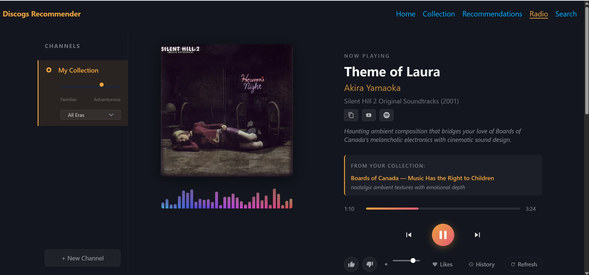
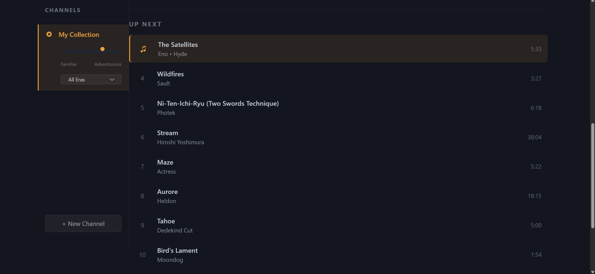

# Discogs Recommender

A web app for discovering music through AI-curated radio, Spotify/YouTube playlist import, and Discogs collection analysis. Works out of the box with zero configuration — no API keys required.

## Quick Start

```bash
git clone <repository-url>
cd discogs_recommender
python -m venv venv

# Windows:
venv\Scripts\activate
# macOS/Linux:
source venv/bin/activate

pip install -r requirements.txt
uvicorn app:app --port 8000
```

Open [http://localhost:8000](http://localhost:8000). That's it — no `.env` file needed.

### Optional: Local AI with Ollama (free)

Install [Ollama](https://ollama.com), then pull a model:

```bash
ollama pull llama3.1:8b
```

The app auto-detects Ollama running on `localhost:11434` and uses it for AI recommendations. No API key needed.

### Optional: Docker

```bash
docker compose up
```

See [Docker setup](#docker) for details.

## Features

- **Radio Mode** — AI-generated playlists with YouTube playback, audio visualizer, queue management, and thumbs-up tracking
- **Spotify Playlist Import** — Use any Spotify playlist as a seed for AI recommendations (no Spotify account required)
- **YouTube Playlist Import** — Import YouTube playlists via yt-dlp (no API key required)
- **Collection Dashboard** — Overview of your Discogs collection with top genres, styles, artists, and labels
- **Collection Browser** — Paginated grid view of all your releases with cover art
- **Genre/Style Recommendations** — Algorithmic scoring based on collection profile overlap, with a discovery slider
- **AI Recommendations** — Claude or Ollama-powered suggestions with explanations and standout tracks
- **Hardware Detection** — Auto-detects system resources and recommends appropriate AI models
- **Zero-Config Deployment** — Works without any API keys; features unlock progressively as keys are added

## Screenshots

### Radio Player
AI-curated playlist with YouTube playback, audio visualizer, share/copy buttons, and collection-based recommendations.


### Now Playing
Track info with copy-to-clipboard buttons for song text, YouTube link, and Spotify search.



### Queue
Up Next queue with per-track YouTube and Spotify share icons.



### Collection Browser
Paginated grid view of your Discogs releases with cover art, genres, and styles.


## Architecture

```
Browser (HTML/JS)
    |
FastAPI (app.py)
    |
    +-- services/
    |   +-- discogs_service.py          Discogs API wrapper with rate limiting
    |   +-- recommendation.py           Genre/style scoring engine
    |   +-- claude_recommender.py       AI recommendations (Claude or Ollama)
    |   +-- radio_service.py            Playlist generation + YouTube resolution
    |   +-- channel_service.py          Radio channel management
    |   +-- youtube_playlist_service.py YouTube playlist import (yt-dlp)
    |   +-- hardware_service.py         Cross-platform hardware detection
    |   +-- auth_service.py             User auth + auto-login
    |   +-- thumbs.py                   User preference persistence (JSON)
    |   +-- cache.py                    In-memory TTL cache with size limits
    |
    +-- templates/                      Jinja2 HTML templates
    +-- static/css/, static/js/         Frontend assets
```

## Configuration

All configuration is optional. The app works with no `.env` file at all.

```bash
cp .env.example .env   # optional
```

| Variable | Required | Description |
|----------|----------|-------------|
| `DISCOGS_TOKEN` | No | Enables collection-based features. Get one at [discogs.com/settings/developers](https://www.discogs.com/settings/developers) |
| `DISCOGS_USERNAME` | No | Your Discogs username (needed with token) |
| `ANTHROPIC_API_KEY` | No | Enables Claude AI recommendations. Get one at [console.anthropic.com](https://console.anthropic.com) |
| `OLLAMA_BASE_URL` | No | Ollama API URL (default: `http://localhost:11434`) |
| `OLLAMA_MODEL` | No | Ollama model name (default: `llama3.1:8b`) |
| `SECRET_KEY` | No | Session secret; auto-generated if not set (sessions won't survive restarts without it) |

> **Security note:** Never commit your `.env` file. It is already listed in `.gitignore`.

### What works without any keys

| Feature | No keys | + Ollama | + Discogs | + Claude |
|---------|---------|----------|-----------|----------|
| Spotify playlist import | Play only | AI recommendations | + collection matching | + Claude quality |
| YouTube playlist import | Play only | AI recommendations | + collection matching | + Claude quality |
| Themed radio channels | — | Full AI curation | + taste-aware | + Claude quality |
| Collection dashboard | — | — | Full features | Full features |
| Genre recommendations | — | — | Full features | Full features |
| AI recommendations | — | Ollama-powered | + collection context | Claude-powered |

## How It Works

### Radio Mode

AI generates a 40-song playlist curated to your taste: 60% familiar territory, 40% genuine discoveries. Songs are resolved to YouTube videos for playback. Features include a canvas-based audio visualizer, queue management, keyboard shortcuts (Space/arrows), and thumbs-up tracking that influences future playlists.

**Channel types:**
- **Discogs Collection** — Uses your vinyl/CD collection as the seed
- **Spotify Playlist** — Import any public Spotify playlist URL
- **YouTube Playlist** — Import any public YouTube playlist URL
- **Themed** — Describe a mood, genre, or vibe and AI builds a playlist

**Modes:**
- **Play Playlist** — Plays imported tracks directly (no AI needed)
- **Similar Songs** — AI finds songs similar to the imported tracks
- **New Discoveries** — AI uses the playlist as a jumping-off point for exploration

### Genre/Style Engine

Analyzes your collection to build a profile of your top genres, styles, artists, and labels. Searches Discogs for releases matching those traits, scores each candidate by how well it overlaps with your profile, and filters out anything you already own. The **discovery slider** (0-100%) controls how adventurous results are.

### Claude AI Engine

Sends a summary of your collection profile plus a sample of 30 releases to Claude (or Ollama), which returns 10-15 contextual recommendations with explanations and standout tracks.

## Hardware Detection

On first visit, the app checks your system and shows advisory banners:

- **RAM < 8 GB** — "Local AI may be slow on this system"
- **No GPU detected** — "Ollama will use CPU (slower but functional)"
- **Ollama not installed** — Links to installation guide

The hardware endpoint (`/api/system/hardware`) reports CPU cores, RAM tier, GPU presence, and Ollama status. No serial numbers, paths, or sensitive data is exposed.

### Recommended Ollama Models by Hardware

| RAM | GPU | Recommended Model |
|-----|-----|-------------------|
| 16 GB+ | Yes | `llama3.1:8b` |
| 16 GB+ | No | `llama3.1:8b` (slower) |
| 8-16 GB | Any | `llama3.2:3b` or `phi3:mini` |
| < 8 GB | Any | `phi3:mini` or use Claude API |

## Docker

### Basic (app only)

```bash
docker compose up
```

The app runs on port 8000 with no `.env` required.

### With Ollama (free local AI)

Uncomment the Ollama service in `docker-compose.yml`:

```yaml
services:
  ollama:
    image: ollama/ollama:latest
    ports:
      - "11434:11434"
    volumes:
      - ollama_data:/root/.ollama
```

Then:

```bash
docker compose up -d
docker compose exec ollama ollama pull llama3.1:8b
```

### Environment variables in Docker

Pass API keys via environment or `.env`:

```bash
docker compose up -e ANTHROPIC_API_KEY=sk-ant-xxx
# or create .env file (optional)
```

## Rate Limits

The Discogs API allows 60 authenticated requests per minute. The app caches data at multiple levels:

| Data | Cache TTL |
|------|-----------|
| Collection | 1 hour |
| Genre recommendations | 30 minutes |
| Claude recommendations | 30 minutes |
| Release details | 1 hour |
| Radio playlists | 2 hours |
| YouTube videos | 24 hours |

Use the refresh buttons in the UI to force re-fetches when needed.

## Testing

The project includes a comprehensive test suite with **265 unit tests** achieving **95% code coverage**. Tests cover functional correctness and security hardening mapped to modern CWE categories.

### Running the tests

```bash
# Run all tests
python -m pytest

# Run with verbose output
python -m pytest -v

# Run with coverage report
python -m pytest --cov=. --cov-report=term-missing

# Run a specific test file
python -m pytest tests/test_cache.py

# Run a specific test class
python -m pytest tests/test_security.py::TestCWE20_InputValidation

# Run a single test
python -m pytest tests/test_thumbs.py::TestSaveThumb::test_save_basic
```

### Test structure

```
tests/
  conftest.py               Shared fixtures (sample collections, profiles, temp dirs)
  test_cache.py              Cache service: get/set, TTL, eviction, key validation
  test_thumbs.py             Thumbs service: save/load, sanitization, atomic writes, resource limits
  test_discogs_service.py    Discogs API: serialization, rate limiting, input sanitization
  test_recommendation.py     Scoring algorithm: profile building, scoring, ownership detection
  test_claude_recommender.py Claude integration: JSON parsing, enrichment, error handling
  test_radio_service.py      Radio: playlist generation, YouTube resolution, caching
  test_app.py                FastAPI routes: all endpoints, validation, security headers
  test_security.py           Security-focused tests organized by CWE category
```

### CWE security coverage

The test suite validates protections against these vulnerability classes:

| CWE | Description | What's tested |
|-----|-------------|---------------|
| CWE-20 | Improper Input Validation | Null bytes, control chars, length limits, type enforcement on all inputs |
| CWE-22 | Path Traversal | Release ID type enforcement prevents path injection; thumbs file confined to data dir |
| CWE-79 | Cross-site Scripting | Jinja2 auto-escaping verified for search queries with `<script>` and `onerror` payloads |
| CWE-138 | Improper Neutralization of Special Elements | Null byte and control character stripping in all user inputs |
| CWE-200 | Exposure of Sensitive Information | API docs disabled; error messages don't leak internal hostnames |
| CWE-209 | Error Message Info Leak | API keys and tokens redacted from all error messages |
| CWE-367 | TOCTOU Race Condition | Atomic file writes for thumbs.json using temp file + rename |
| CWE-400 | Uncontrolled Resource Consumption | Cache max-entry limits; thumbs file size limits; input length truncation |
| CWE-502 | Deserialization of Untrusted Data | Safe JSON parsing; Pydantic validation on all request bodies; malformed JSON handled |
| CWE-601 | Open Redirect | No redirect endpoints; static file path traversal blocked |
| CWE-693 | Protection Mechanism Failure | Security headers verified on all routes (X-Frame-Options, CSP, etc.) |
| CWE-770 | Resource Allocation Without Limits | Max cache entries, max thumbs entries, per-page limits on API calls |
| CWE-918 | Server-Side Request Forgery | Search params passed to API, not fetched as URLs; release ID is integer-only |

## Security Hardening

- **Input validation** — All user inputs are sanitized: null bytes stripped, control characters removed, strings truncated to max lengths, types enforced via Pydantic models
- **Error message sanitization** — API keys and tokens are redacted from error messages before they reach the user
- **Security headers** — `X-Content-Type-Options`, `X-Frame-Options`, `Referrer-Policy`, and `X-XSS-Protection` headers on all responses
- **API docs disabled** — Swagger UI and ReDoc are disabled (`docs_url=None, redoc_url=None`)
- **Atomic file writes** — Thumbs data written via temp file + rename to prevent corruption
- **Resource limits** — Cache size capped, thumbs file size limited, input field lengths bounded
- **Request validation** — Pydantic `BaseModel` with `Field` constraints validates all POST request bodies
- **Non-root Docker** — Container runs as unprivileged `appuser`
- **Hardware endpoint** — Only exposes aggregate system info (core count, RAM tier, GPU yes/no); no serial numbers, paths, or process lists

## API Endpoints

| Endpoint | Method | Auth | Description |
|----------|--------|------|-------------|
| `/api/system/status` | GET | No | Service availability (Discogs, Claude, Ollama) |
| `/api/system/hardware` | GET | Yes | Hardware info and AI model recommendations |
| `/api/radio/channels` | GET/POST | Yes | List or create radio channels |
| `/api/radio/playlist-stream` | GET | Yes | SSE stream for playlist generation |
| `/api/radio/youtube-preview` | POST | Yes | Preview a YouTube playlist |
| `/api/radio/youtube-channel` | POST | Yes | Create channel from YouTube playlist |
| `/api/radio/spotify-preview` | POST | Yes | Preview a Spotify playlist |
| `/api/radio/feedback` | POST | Yes | Submit track feedback |

## Project Configuration

| File | Purpose |
|------|---------|
| `.env.example` | Template for environment variables (all optional) |
| `.gitignore` | Excludes `.env`, `__pycache__`, `venv`, test artifacts |
| `pytest.ini` | Pytest configuration (test paths, verbosity) |
| `requirements.txt` | Python dependencies (runtime + testing) |
| `Dockerfile` | Container build with healthcheck and non-root user |
| `docker-compose.yml` | Multi-service deployment (app + optional Ollama) |
