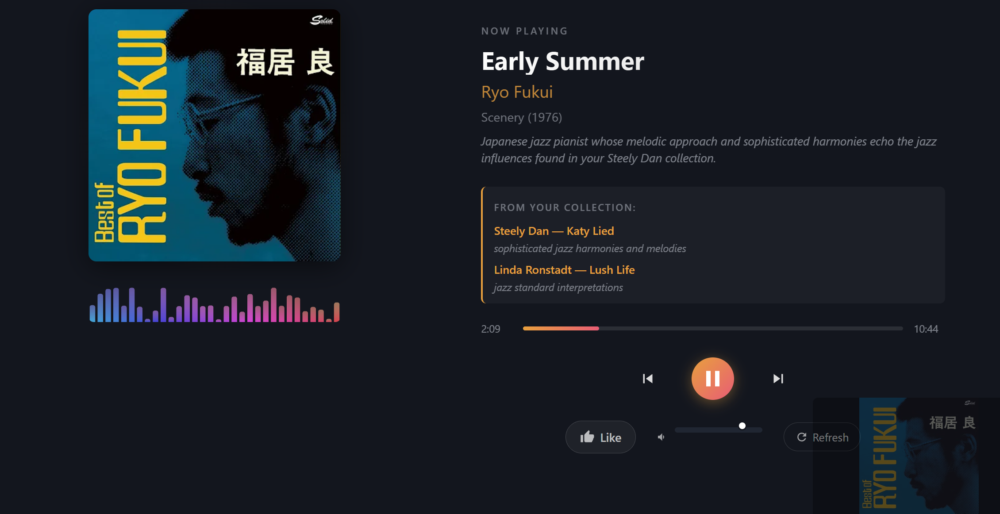
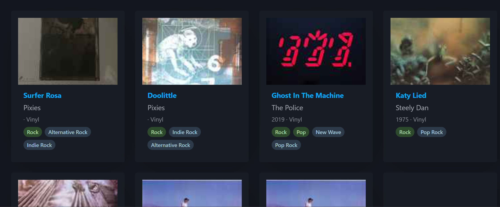

# Discogs Recommender

A web app that analyzes your Discogs vinyl/CD collection and recommends new albums using genre/style matching, AI-powered suggestions from Claude, and an AI-curated radio player with YouTube integration.

## Features

- **Collection Dashboard** -- Overview of your collection with top genres, styles, artists, and labels
- **Collection Browser** -- Paginated grid view of all your releases with cover art
- **Genre/Style Recommendations** -- Algorithmic scoring based on collection profile overlap, with a discovery slider (0-100%) to control how adventurous results are
- **AI Recommendations** -- Claude-powered suggestions with explanations, standout tracks, and Discogs links
- **Radio Mode** -- Claude generates 40-song playlists with YouTube playback, visualizer, queue management, and thumbs-up tracking
- **Discogs Search** -- Multi-field search across releases, artists, genres, styles, and labels
- **Release Details** -- Full metadata, tracklist, and marketplace info for any release

## Screenshots

### Radio Player
AI-curated playlist with YouTube playback, audio visualizer, and collection-based recommendations.



### Collection Browser
Paginated grid view of your Discogs releases with cover art, genres, and styles.



## Architecture

```
Browser (HTML/JS)
    |
FastAPI (app.py)
    |
    +-- services/
    |   +-- discogs_service.py    Discogs API wrapper with rate limiting
    |   +-- recommendation.py     Genre/style scoring engine
    |   +-- claude_recommender.py Claude AI recommendations
    |   +-- radio_service.py      Playlist generation + YouTube resolution
    |   +-- thumbs.py             User preference persistence (JSON)
    |   +-- cache.py              In-memory TTL cache with size limits
    |
    +-- templates/                Jinja2 HTML templates
    +-- static/css/, static/js/   Frontend assets
```

## Setup

### Prerequisites

- Python 3.10+
- A Discogs account with releases in your collection
- A [Discogs personal access token](https://www.discogs.com/settings/developers)
- An [Anthropic API key](https://console.anthropic.com/)

### 1. Clone the repository

```bash
git clone <repository-url>
cd discogs_recommender
```

### 2. Create and activate a virtual environment

```bash
python -m venv venv

# Windows:
venv\Scripts\activate

# macOS/Linux:
source venv/bin/activate
```

### 3. Install dependencies

```bash
pip install -r requirements.txt
```

This installs both runtime dependencies (FastAPI, Anthropic SDK, Discogs client, etc.) and testing dependencies (pytest, pytest-cov).

### 4. Configure environment variables

```bash
cp .env.example .env
```

Edit `.env` and fill in your values:

```
DISCOGS_TOKEN=your_discogs_token_here
DISCOGS_USERNAME=your_discogs_username_here
ANTHROPIC_API_KEY=sk-ant-your_key_here
```

> **Security note:** Never commit your `.env` file. It is already listed in `.gitignore`.

### 5. Run the app

```bash
uvicorn app:app --reload --port 8000
```

Open [http://localhost:8000](http://localhost:8000) in your browser.

## How the Recommendation Engines Work

### Genre/Style Engine

Analyzes your collection to build a profile of your top genres, styles, artists, and labels. Searches Discogs for releases matching those traits, scores each candidate by how well it overlaps with your profile, and filters out anything you already own. The **discovery slider** (0-100%) controls how adventurous results are:

- **0%** -- Safe favorites: emphasizes known artists and top styles
- **50%** -- Balanced: mixes familiar and new territory
- **100%** -- Full discovery: searches broadly by genre, adds random jitter to scores, reduces artist weight

### Claude AI Engine

Sends a summary of your collection profile plus a sample of 30 releases to Claude, which returns 10-15 contextual recommendations with explanations and standout tracks. Each recommendation is cross-referenced with Discogs to provide direct links.

### Radio Mode

Claude generates a 40-song playlist curated to your taste: 60% familiar territory, 40% genuine discoveries. Songs are resolved to YouTube videos for playback. Features include a canvas-based audio visualizer, queue management, keyboard shortcuts (Space/arrows), and thumbs-up tracking that influences future playlists.

## Rate Limits

The Discogs API allows 60 authenticated requests per minute. The app caches data at multiple levels:

| Data | Cache TTL |
|------|-----------|
| Collection | 1 hour |
| Genre recommendations | 30 minutes |
| Claude recommendations | 30 minutes |
| Release details | 1 hour |
| Radio playlists | 2 hours |
| YouTube videos | 24 hours |

Use the refresh buttons in the UI to force re-fetches when needed.

## Testing

The project includes a comprehensive test suite with **224 unit tests** achieving **95% code coverage**. Tests cover functional correctness and security hardening mapped to modern CWE categories.

### Running the tests

```bash
# Run all tests
python -m pytest

# Run with verbose output
python -m pytest -v

# Run with coverage report
python -m pytest --cov=. --cov-report=term-missing

# Run a specific test file
python -m pytest tests/test_cache.py

# Run a specific test class
python -m pytest tests/test_security.py::TestCWE20_InputValidation

# Run a single test
python -m pytest tests/test_thumbs.py::TestSaveThumb::test_save_basic
```

### Test structure

```
tests/
  conftest.py               Shared fixtures (sample collections, profiles, temp dirs)
  test_cache.py              Cache service: get/set, TTL, eviction, key validation
  test_thumbs.py             Thumbs service: save/load, sanitization, atomic writes, resource limits
  test_discogs_service.py    Discogs API: serialization, rate limiting, input sanitization
  test_recommendation.py     Scoring algorithm: profile building, scoring, ownership detection
  test_claude_recommender.py Claude integration: JSON parsing, enrichment, error handling
  test_radio_service.py      Radio: playlist generation, YouTube resolution, caching
  test_app.py                FastAPI routes: all endpoints, validation, security headers
  test_security.py           Security-focused tests organized by CWE category
```

### CWE security coverage

The test suite validates protections against these vulnerability classes:

| CWE | Description | What's tested |
|-----|-------------|---------------|
| CWE-20 | Improper Input Validation | Null bytes, control chars, length limits, type enforcement on all inputs |
| CWE-22 | Path Traversal | Release ID type enforcement prevents path injection; thumbs file confined to data dir |
| CWE-79 | Cross-site Scripting | Jinja2 auto-escaping verified for search queries with `<script>` and `onerror` payloads |
| CWE-138 | Improper Neutralization of Special Elements | Null byte and control character stripping in all user inputs |
| CWE-200 | Exposure of Sensitive Information | API docs disabled; error messages don't leak internal hostnames |
| CWE-209 | Error Message Info Leak | API keys and tokens redacted from all error messages |
| CWE-367 | TOCTOU Race Condition | Atomic file writes for thumbs.json using temp file + rename |
| CWE-400 | Uncontrolled Resource Consumption | Cache max-entry limits; thumbs file size limits; input length truncation |
| CWE-502 | Deserialization of Untrusted Data | Safe JSON parsing; Pydantic validation on all request bodies; malformed JSON handled |
| CWE-601 | Open Redirect | No redirect endpoints; static file path traversal blocked |
| CWE-693 | Protection Mechanism Failure | Security headers verified on all routes (X-Frame-Options, CSP, etc.) |
| CWE-770 | Resource Allocation Without Limits | Max cache entries, max thumbs entries, per-page limits on API calls |
| CWE-918 | Server-Side Request Forgery | Search params passed to API, not fetched as URLs; release ID is integer-only |

### Interpreting test results

A successful run looks like:

```
====================== 224 passed, 0 failed in ~3s =======================
```

If any tests fail, the output shows:
- Which test failed and in which file
- The assertion that didn't hold
- A short traceback pointing to the exact line

Example of investigating a failure:

```bash
# Run just the failing test with full traceback
python -m pytest tests/test_security.py::TestCWE20_InputValidation::test_cache_key_validation -v --tb=long
```

## Security hardening

The following security measures are implemented in the application code:

- **Input validation** -- All user inputs are sanitized: null bytes stripped, control characters removed, strings truncated to max lengths, types enforced via Pydantic models
- **Error message sanitization** -- API keys and tokens are redacted from error messages before they reach the user
- **Security headers** -- `X-Content-Type-Options`, `X-Frame-Options`, `Referrer-Policy`, and `X-XSS-Protection` headers on all responses
- **API docs disabled** -- Swagger UI and ReDoc are disabled (`docs_url=None, redoc_url=None`)
- **Atomic file writes** -- Thumbs data written via temp file + rename to prevent corruption
- **Resource limits** -- Cache size capped, thumbs file size limited, input field lengths bounded
- **Request validation** -- Pydantic `BaseModel` with `Field` constraints validates all POST request bodies
- **Search type whitelist** -- Only allowed Discogs search types (`release`, `master`, `artist`, `label`) are accepted

## Project configuration

| File | Purpose |
|------|---------|
| `.env.example` | Template for environment variables |
| `.gitignore` | Excludes `.env`, `__pycache__`, `venv`, test artifacts |
| `pytest.ini` | Pytest configuration (test paths, verbosity) |
| `requirements.txt` | Python dependencies (runtime + testing) |
