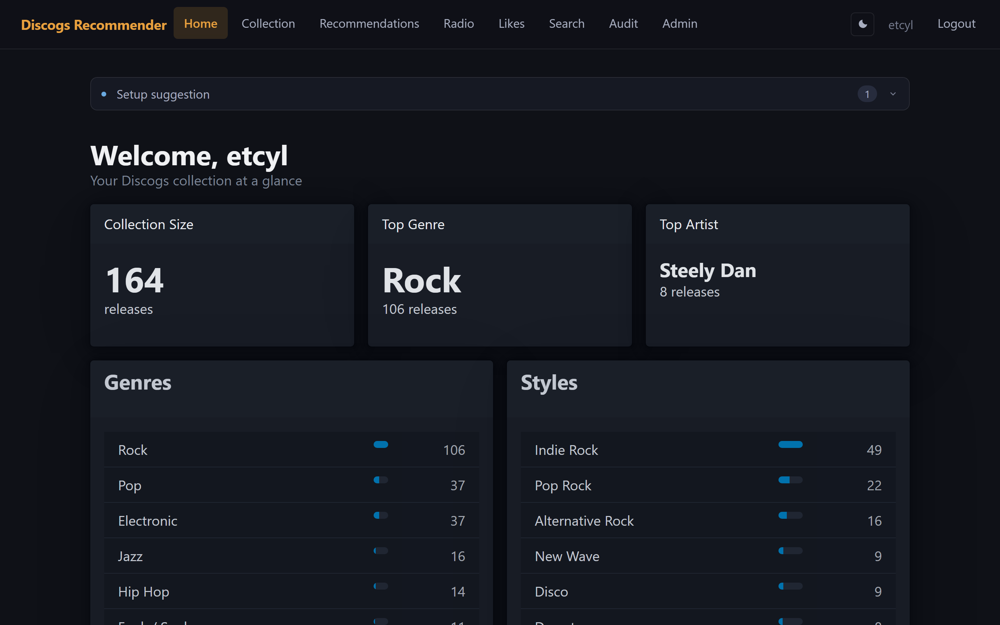
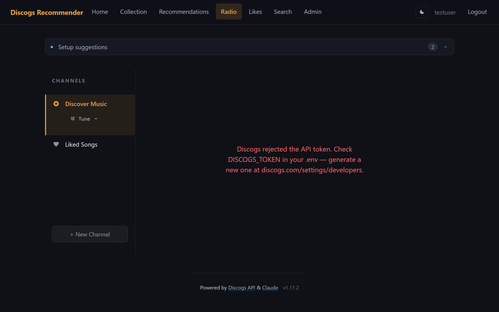
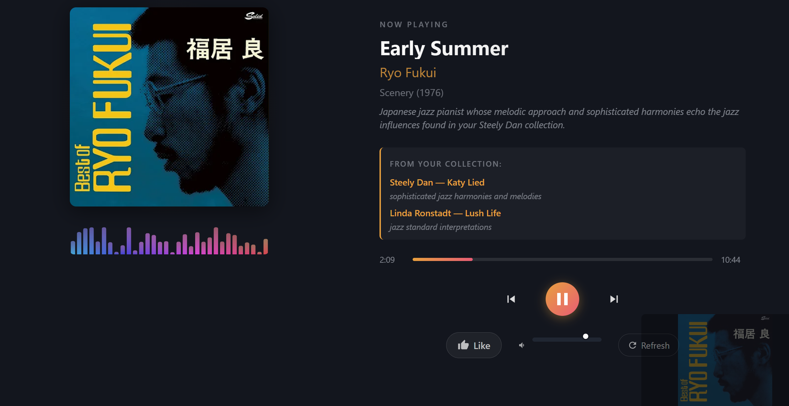
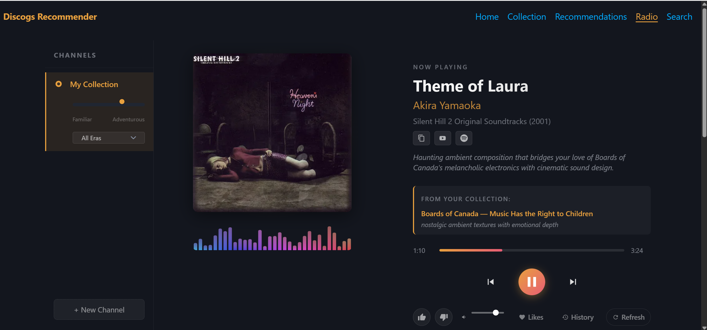
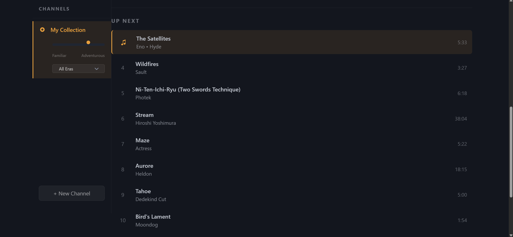
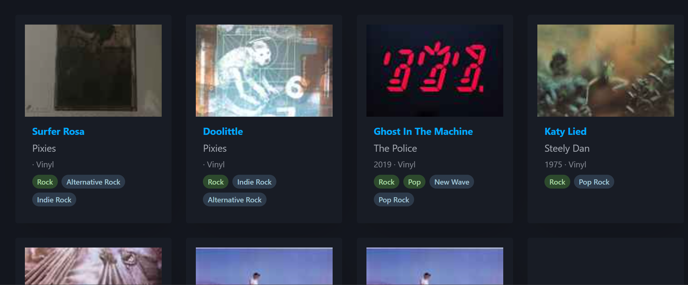
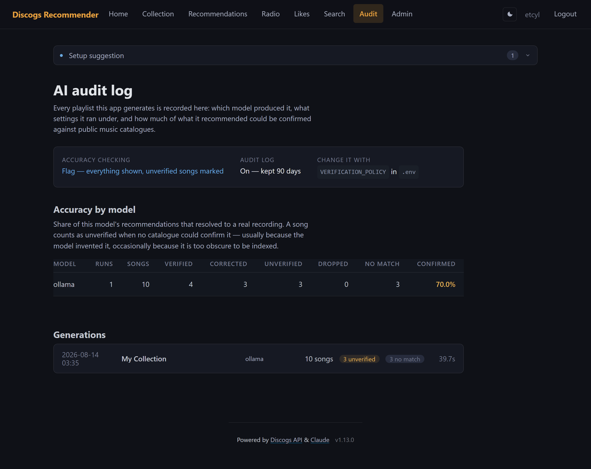

# Discogs Recommender

A web app for discovering music through AI-curated radio, Spotify/YouTube playlist import, and Discogs collection analysis. Works out of the box with zero configuration — no API keys required.

## Quick Start

```bash
git clone <repository-url>
cd discogs_recommender
python -m venv venv

# Windows:
venv\Scripts\activate
# macOS/Linux:
source venv/bin/activate

pip install -r requirements.txt
uvicorn app:app --port 8000
```

Open [http://localhost:8000](http://localhost:8000). That's it — no `.env` file needed.

### Optional: Local AI with Ollama (free)

Install [Ollama](https://ollama.com), then pull a model:

```bash
ollama pull llama3.1:8b
```

The app auto-detects Ollama running on `localhost:11434` and uses it for AI recommendations. No API key needed.

Ollama requests use **schema-constrained decoding** — the JSON shape is enforced
during generation rather than requested in the prompt. This matters more than it
sounds: without it, reasoning models (`qwen3`, `deepseek-r1`, `gpt-oss`) spend
their entire token budget on a hidden thinking pass and return nothing at all,
and non-reasoning models regularly bury the JSON in prose. Reasoning models are
detected automatically via `/api/show` and have thinking disabled.

If you run a **24B+ local model**, set `PROMPT_TIER=rich` in `.env`. Otherwise
local models get the same stripped-down prompt as a 3B model, which throws away
most of what a large one can do.

> **Know what you're getting.** Local models invent a lot of songs. Measured on
> a 25-track seed, the share of recommendations that resolve to a real recording
> was **48%** for `llama3.1:8b` and **44%** for `gemma3:27b`. See
> [bench/verification.md](bench/verification.md) for the method and the misses.

### Optional: Docker

```bash
docker compose up
```

See [Docker setup](#docker) for details.

## Features

- **Radio Mode** — AI-generated playlists with YouTube playback, audio visualizer, queue management, and thumbs-up tracking
- **Spotify Playlist Import** — Use any Spotify playlist as a seed for AI recommendations (no Spotify account required)
- **YouTube Playlist Import** — Import YouTube playlists via yt-dlp (no API key required)
- **Collection Dashboard** — Overview of your Discogs collection with top genres, styles, artists, and labels
- **Collection Browser** — Paginated grid view of all your releases with cover art
- **Genre/Style Recommendations** — Algorithmic scoring based on collection profile overlap, with a discovery slider
- **AI Recommendations** — Claude or Ollama-powered suggestions with explanations and standout tracks
- **Hardware Detection** — Auto-detects system resources and recommends appropriate AI models
- **Zero-Config Deployment** — Works without any API keys; features unlock progressively as keys are added

## Screenshots

### Home



### Radio

Channel list with per-channel settings tucked into a drawer, so the list stays
scannable however many channels you have.



### Radio player

AI-curated playlist with YouTube playback, audio visualizer, share/copy buttons,
and collection-based recommendations.



### Now playing

Track info with copy-to-clipboard buttons for song text, YouTube link, and Spotify search.



### Queue

Up Next queue with per-track YouTube and Spotify share icons.



### Collection browser

Paginated grid view of your Discogs releases with cover art, genres, and styles.



Screenshots are generated from the running app — see
[Regenerating screenshots](#regenerating-screenshots). The UI before the
recent pass is kept in [`docs/before/`](docs/before/) for comparison.

## Architecture

```
Browser (HTML/JS)
    |
FastAPI (app.py)
    |
    +-- services/
    |   +-- discogs_service.py          Discogs API wrapper with rate limiting
    |   +-- recommendation.py           Genre/style scoring engine
    |   +-- claude_recommender.py       AI recommendations (Claude or Ollama)
    |   +-- radio_service.py            Playlist generation + YouTube resolution
    |   +-- channel_service.py          Radio channel management
    |   +-- youtube_playlist_service.py YouTube playlist import (yt-dlp)
    |   +-- hardware_service.py         Cross-platform hardware detection
    |   +-- auth_service.py             User auth + auto-login
    |   +-- thumbs.py                   User preference persistence (JSON)
    |   +-- cache.py                    In-memory TTL cache with size limits
    |
    +-- templates/                      Jinja2 HTML templates
    +-- static/css/, static/js/         Frontend assets
    |
    +-- tools/                          Bench, comparison, verification, screenshots
    +-- bench/                          Seeds, prompts, saved runs, reports
```

A walkthrough of how the playlist pipeline actually works, the bugs found in
it, and where the remaining performance and structural wins are, is in
**[docs/REVIEW.md](docs/REVIEW.md)**.

## Accuracy and guardrails

Language models invent songs. Measured on this app's own prompts, the share of
recommendations that resolve to a real recording ranged from **44% to 100%**
depending on the model — and the failures are not obvious noise:
`Portishead — Silent Shout` is a The Knife song, `Nico — Janitor for God`
should be *Janitor of Lunacy*, `Galaxie 2000` should be Galaxie 500.

So the app checks. Every recommendation is resolved against Deezer, then
iTunes, then MusicBrainz before it reaches the player, and each one carries a
badge saying what backed it up:

| `VERIFICATION_POLICY` | Behaviour |
|---|---|
| `off` | No checking. Fastest; you are trusting the model. |
| `flag` | **Default.** Everything shown, with a badge. |
| `strict` | Unconfirmed recommendations are dropped before you see them. |

Alongside that:

- **Model-written explanations are labelled as claims**, not facts. Nothing
  verifies the assertion that two records share a producer.
- **Every generation is logged** — model, settings, timing, and each song's
  verification outcome, *including songs that were dropped*. Readable at
  `/audit`, with per-run JSON export.
- **Untrusted text is fenced.** Imported playlists are authored by strangers,
  and a track can legally be titled `Ignore all previous instructions`. Song
  titles, themes and uploads are sanitised and wrapped in nonce-delimited
  blocks before they reach the prompt.
- **Catalogue identity beats a video title.** When YouTube resolution rewrites
  a track's name into something a catalogue contradicts — an interview clip, a
  podcast episode — the confirmed name is restored.

Full threat model, what each layer does, and where each one stops:
**[docs/SAFETY.md](docs/SAFETY.md)**.



## Configuration

All configuration is optional. The app works with no `.env` file at all.

```bash
cp .env.example .env   # optional
```

| Variable | Required | Description |
|----------|----------|-------------|
| `DISCOGS_USERNAME` | No | Your Discogs username. **On its own this is enough** if your collection is public — no token needed. |
| `DISCOGS_TOKEN` | No | Only needed for a *private* collection, or for the genre/style engine, which searches the Discogs catalogue. Get one at [discogs.com/settings/developers](https://www.discogs.com/settings/developers) |
| `ANTHROPIC_API_KEY` | No | Enables Claude AI recommendations. Get one at [console.anthropic.com](https://console.anthropic.com) |
| `OLLAMA_BASE_URL` | No | Ollama API URL (default: `http://localhost:11434`) |
| `OLLAMA_MODEL` | No | Ollama model name (default: `llama3.1:8b`) |
| `PROMPT_TIER` | No | `auto` (default), `compact`, or `rich`. `auto` gives Ollama and Haiku the short prompt and Sonnet the full curator prompt. Set `rich` for 24B+ local models. |
| `VERIFICATION_POLICY` | No | `flag` (default), `off`, or `strict`. How hard to fact-check AI recommendations against public music catalogues. See [docs/SAFETY.md](docs/SAFETY.md) |
| `AUDIT_ENABLED` | No | `true` (default). Record every generation to the audit log at `/audit` |
| `AUDIT_RETENTION_DAYS` | No | `90` (default). How long audit runs are kept |
| `DISCOGS_DATA_DIR` | No | Move all on-disk state (database, per-user JSON) somewhere else |
| `SECRET_KEY` | No | Session secret; auto-generated if not set (sessions won't survive restarts without it) |

> **Security note:** Never commit your `.env` file. It is already listed in `.gitignore`.

### What works without any keys

| Feature | No keys | + Ollama | + Discogs | + Claude |
|---------|---------|----------|-----------|----------|
| Spotify playlist import | Play only | AI recommendations | + collection matching | + Claude quality |
| YouTube playlist import | Play only | AI recommendations | + collection matching | + Claude quality |
| Themed radio channels | — | Full AI curation | + taste-aware | + Claude quality |
| Collection dashboard | — | — | Full features | Full features |
| Genre recommendations | — | — | Full features | Full features |
| AI recommendations | — | Ollama-powered | + collection context | Claude-powered |

## How It Works

### Radio Mode

AI generates a 40-song playlist curated to your taste: 60% familiar territory, 40% genuine discoveries. Songs are resolved to YouTube videos for playback. Features include a canvas-based audio visualizer, queue management, keyboard shortcuts (Space/arrows), and thumbs-up tracking that influences future playlists.

**Channel types:**
- **Discogs Collection** — Uses your vinyl/CD collection as the seed
- **Spotify Playlist** — Import any public Spotify playlist URL
- **YouTube Playlist** — Import any public YouTube playlist URL
- **Themed** — Describe a mood, genre, or vibe and AI builds a playlist

**Modes:**
- **Play Playlist** — Plays imported tracks directly (no AI needed)
- **Similar Songs** — AI finds songs similar to the imported tracks
- **New Discoveries** — AI uses the playlist as a jumping-off point for exploration

### Genre/Style Engine

Analyzes your collection to build a profile of your top genres, styles, artists, and labels. Searches Discogs for releases matching those traits, scores each candidate by how well it overlaps with your profile, and filters out anything you already own. The **discovery slider** (0-100%) controls how adventurous results are.

### Claude AI Engine

Sends a summary of your collection profile plus a sample of 30 releases to Claude (or Ollama), which returns 10-15 contextual recommendations with explanations and standout tracks.

## Hardware Detection

On first visit, the app checks your system and shows advisory banners:

- **RAM < 8 GB** — "Local AI may be slow on this system"
- **No GPU detected** — "Ollama will use CPU (slower but functional)"
- **Ollama not installed** — Links to installation guide

The hardware endpoint (`/api/system/hardware`) reports CPU cores, RAM tier, GPU presence, and Ollama status. No serial numbers, paths, or sensitive data is exposed.

### Recommended Ollama Models by Hardware

| RAM | GPU | Recommended Model |
|-----|-----|-------------------|
| 16 GB+ | Yes | `llama3.1:8b` |
| 16 GB+ | No | `llama3.1:8b` (slower) |
| 8-16 GB | Any | `llama3.2:3b` or `phi3:mini` |
| < 8 GB | Any | `phi3:mini` or use Claude API |

## Docker

### Basic (app only)

```bash
docker compose up
```

The app runs on port 8000 with no `.env` required.

### With Ollama (free local AI)

Uncomment the Ollama service in `docker-compose.yml`:

```yaml
services:
  ollama:
    image: ollama/ollama:latest
    ports:
      - "11434:11434"
    volumes:
      - ollama_data:/root/.ollama
```

Then:

```bash
docker compose up -d
docker compose exec ollama ollama pull llama3.1:8b
```

### Environment variables in Docker

Pass API keys via environment or `.env`:

```bash
docker compose up -e ANTHROPIC_API_KEY=sk-ant-xxx
# or create .env file (optional)
```

## Rate Limits

The Discogs API allows 60 authenticated requests per minute. The app caches data at multiple levels:

| Data | Cache TTL |
|------|-----------|
| Collection | 1 hour |
| Genre recommendations | 30 minutes |
| Claude recommendations | 30 minutes |
| Release details | 1 hour |
| Radio playlists | 2 hours |
| YouTube videos | 24 hours |

Use the refresh buttons in the UI to force re-fetches when needed.

## Tooling

Scripts in [`tools/`](tools/) for working on the recommender itself. They import
the app's own services, so they exercise the real prompts and the real pipeline
rather than a copy.

### Playlist bench — compare generation approaches

Runs one seed through every available approach and saves each result so they can
be compared side by side.

```bash
# Seed from a text file of "Artist - Title" lines
python tools/playlist_bench.py --tracks bench/seeds/demo_playlist.txt \
    --provider ollama:llama3.1:8b \
    --provider ollama:qwen3:30b-a3b \
    --provider ollama:gemma3:27b -n 25

# Seed from a public Spotify or YouTube playlist (no credentials needed)
python tools/playlist_bench.py --spotify https://open.spotify.com/playlist/XXXX --provider ollama:gemma3:27b
python tools/playlist_bench.py --youtube 'https://www.youtube.com/playlist?list=PLXXXX' --provider ollama:gemma3:27b

# Seed from a Discogs collection, including the no-LLM baseline
python tools/playlist_bench.py --discogs --discogs-token TOKEN --discogs-username NAME \
    --provider algorithmic --provider ollama:gemma3:27b
```

Providers: `ollama:<model>`, `claude-sonnet`, `claude-haiku`, `algorithmic`
(collection scoring, no LLM), and `claude-code`.

The `claude-code` provider needs no API key. It writes the exact prompt the app
would have sent to `bench/prompts/<run-id>.json`, an agent answers it offline,
and the answer is read back in:

```bash
python tools/playlist_bench.py --tracks bench/seeds/demo_playlist.txt --provider claude-code
# ...agent writes a JSON array to bench/responses/<run-id>.json...
python tools/playlist_bench.py --ingest bench/prompts/<run-id>.json \
                               --response bench/responses/<run-id>.json
```

### Comparing and verifying runs

```bash
python tools/compare_runs.py    # -> bench/comparison.md
python tools/verify_runs.py     # -> bench/verification.md
```

`compare_runs.py` produces a metrics table (artist diversity, decade spread,
seed leakage, field completeness), a provider overlap matrix, and the picks only
one provider made.

`verify_runs.py` answers the question the structural metrics can't: **do these
songs exist?** Every pick is resolved against Deezer, then iTunes, then
MusicBrainz. This is where the providers actually separate — see
[bench/verification.md](bench/verification.md).

### Regenerating screenshots

```bash
pip install playwright && playwright install chromium
uvicorn app:app --port 8000          # in another terminal
python tools/screenshot.py --out docs/after
```

## Testing

The project includes a comprehensive test suite of **456 unit tests** covering functional correctness, the accuracy and guardrail layers, and security hardening mapped to modern CWE categories.

Tests write to a throwaway directory (`DISCOGS_DATA_DIR`), so running them never touches your real collection data or database.

### Running the tests

```bash
# Run all tests
python -m pytest

# Run with verbose output
python -m pytest -v

# Run with coverage report
python -m pytest --cov=. --cov-report=term-missing

# Run a specific test file
python -m pytest tests/test_cache.py

# Run a specific test class
python -m pytest tests/test_security.py::TestCWE20_InputValidation

# Run a single test
python -m pytest tests/test_thumbs.py::TestSaveThumb::test_save_basic
```

### Test structure

```
tests/
  conftest.py               Shared fixtures (sample collections, profiles, temp dirs)
  test_cache.py              Cache service: get/set, TTL, eviction, key validation
  test_thumbs.py             Thumbs service: save/load, sanitization, atomic writes, resource limits
  test_discogs_service.py    Discogs API: serialization, rate limiting, input sanitization
  test_recommendation.py     Scoring algorithm: profile building, scoring, ownership detection
  test_claude_recommender.py Claude integration: JSON parsing, enrichment, error handling
  test_radio_service.py      Radio: playlist generation, YouTube resolution, caching
  test_app.py                FastAPI routes: all endpoints, validation, security headers
  test_security.py           Security-focused tests organized by CWE category
  test_verification.py       Catalogue matching, verification policies, reconciliation
  test_audit.py              Audit log: recording, scoping, retention, failure isolation
  test_guardrails.py         Prompt-injection: sanitising, fencing, detection
  test_discogs_public.py     Token-free public collection access
```

### CWE security coverage

The test suite validates protections against these vulnerability classes:

| CWE | Description | What's tested |
|-----|-------------|---------------|
| CWE-20 | Improper Input Validation | Null bytes, control chars, length limits, type enforcement on all inputs |
| CWE-22 | Path Traversal | Release ID type enforcement prevents path injection; thumbs file confined to data dir |
| CWE-79 | Cross-site Scripting | Jinja2 auto-escaping verified for search queries with `<script>` and `onerror` payloads |
| CWE-138 | Improper Neutralization of Special Elements | Null byte and control character stripping in all user inputs |
| CWE-200 | Exposure of Sensitive Information | API docs disabled; error messages don't leak internal hostnames |
| CWE-209 | Error Message Info Leak | API keys and tokens redacted from all error messages |
| CWE-367 | TOCTOU Race Condition | Atomic file writes for thumbs.json using temp file + rename |
| CWE-400 | Uncontrolled Resource Consumption | Cache max-entry limits; thumbs file size limits; input length truncation |
| CWE-502 | Deserialization of Untrusted Data | Safe JSON parsing; Pydantic validation on all request bodies; malformed JSON handled |
| CWE-601 | Open Redirect | No redirect endpoints; static file path traversal blocked |
| CWE-693 | Protection Mechanism Failure | Security headers verified on all routes (X-Frame-Options, CSP, etc.) |
| CWE-770 | Resource Allocation Without Limits | Max cache entries, max thumbs entries, per-page limits on API calls |
| CWE-918 | Server-Side Request Forgery | Search params passed to API, not fetched as URLs; release ID is integer-only |

## Security Hardening

- **Input validation** — All user inputs are sanitized: null bytes stripped, control characters removed, strings truncated to max lengths, types enforced via Pydantic models
- **Error message sanitization** — API keys and tokens are redacted from error messages before they reach the user
- **Security headers** — `X-Content-Type-Options`, `X-Frame-Options`, `Referrer-Policy`, and `X-XSS-Protection` headers on all responses
- **API docs disabled** — Swagger UI and ReDoc are disabled (`docs_url=None, redoc_url=None`)
- **Atomic file writes** — Thumbs data written via temp file + rename to prevent corruption
- **Resource limits** — Cache size capped, thumbs file size limited, input field lengths bounded
- **Request validation** — Pydantic `BaseModel` with `Field` constraints validates all POST request bodies
- **Non-root Docker** — Container runs as unprivileged `appuser`
- **Hardware endpoint** — Only exposes aggregate system info (core count, RAM tier, GPU yes/no); no serial numbers, paths, or process lists

## API Endpoints

| Endpoint | Method | Auth | Description |
|----------|--------|------|-------------|
| `/api/system/status` | GET | No | Service availability (Discogs, Claude, Ollama) |
| `/api/system/hardware` | GET | Yes | Hardware info and AI model recommendations |
| `/api/radio/channels` | GET/POST | Yes | List or create radio channels |
| `/api/radio/playlist-stream` | GET | Yes | SSE stream for playlist generation |
| `/api/radio/youtube-preview` | POST | Yes | Preview a YouTube playlist |
| `/api/radio/youtube-channel` | POST | Yes | Create channel from YouTube playlist |
| `/api/radio/spotify-preview` | POST | Yes | Preview a Spotify playlist |
| `/api/radio/feedback` | POST | Yes | Submit track feedback |
| `/audit` | GET | Yes | AI generation audit log |
| `/api/audit/runs` | GET | Yes | List generation runs |
| `/api/audit/runs/{id}` | GET | Yes | One run with every song and its verification |
| `/api/audit/export/{id}` | GET | Yes | Download a run as JSON |

## Project Configuration

| File | Purpose |
|------|---------|
| `.env.example` | Template for environment variables (all optional) |
| `.gitignore` | Excludes `.env`, `__pycache__`, `venv`, test artifacts |
| `pytest.ini` | Pytest configuration (test paths, verbosity) |
| `requirements.txt` | Python dependencies (runtime + testing) |
| `Dockerfile` | Container build with healthcheck and non-root user |
| `docker-compose.yml` | Multi-service deployment (app + optional Ollama) |
